# ⚽🏀🏐 SLS — Szkolna Liga Sportowa

> Webowa platforma do zarządzania turniejami sportowymi w szkołach. Trzy dyscypliny, dwa tryby pracy, jeden interfejs.

---

## 📖 Opis aplikacji

**SLS — Szkolna Liga Sportowa** to kompleksowa platforma webowa służąca do kompleksowego zarządzania turniejami sportowymi w szkołach. Aplikacja obsługuje **trzy dyscypliny** — piłkę nożną, koszykówkę i siatkówkę — i oferuje dwa niezależne widoki:

- **Widok publiczny** — dla uczniów, nauczycieli i kibiców: przegląd meczów, wyniki, profile drużyn, rankingi
- **Panel administracyjny** — dla organizatorów: zarządzanie turniejem, planowanie, protokoły meczowe, logowanie

Aplikacja działa w **dwóch trybach**:
- **Demo** — otwórz `index.html` w przeglądarce, dane przykładowe załadowane automatycznie, żaden serwer nie jest wymagany
- **Live** — połączenie z bazą danych Supabase, pełna funkcjonalność z danymi w czasie rzeczywistym

---

## 👁 Podgląd aplikacji

### Widok publiczny

<table>
  <tr>
    <td align="center">
      <a href="Screen/glowny-ekran-aplikacji.png">
        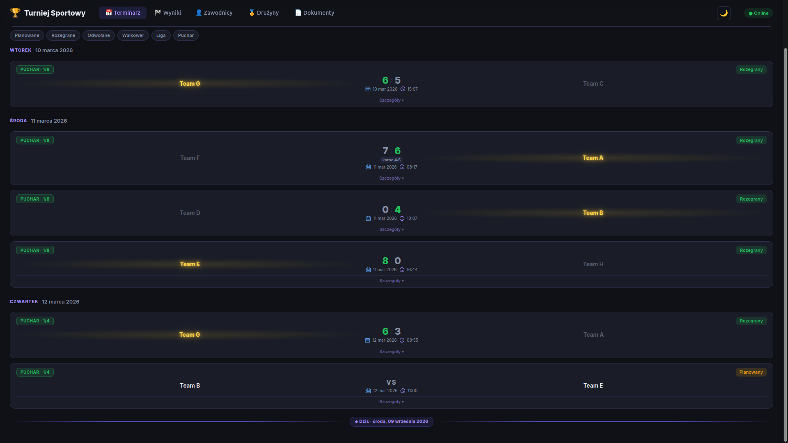
      </a>
      <br>
      <em>Terminarz — przegląd meczów z filtrami</em>
    </td>
    <td align="center">
      <a href="Screen/drabinka-nozna.png">
        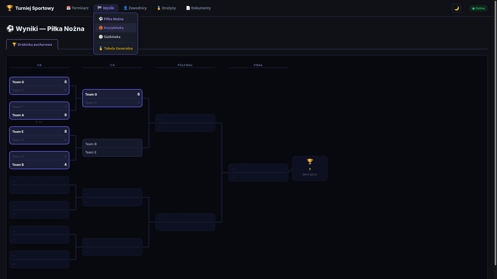
      </a>
      <br>
      <em>Drabinka pucharowa (SVG)</em>
    </td>
  </tr>
  <tr>
    <td align="center">
      <a href="Screen/wyniki-tabela-generalna.png">
        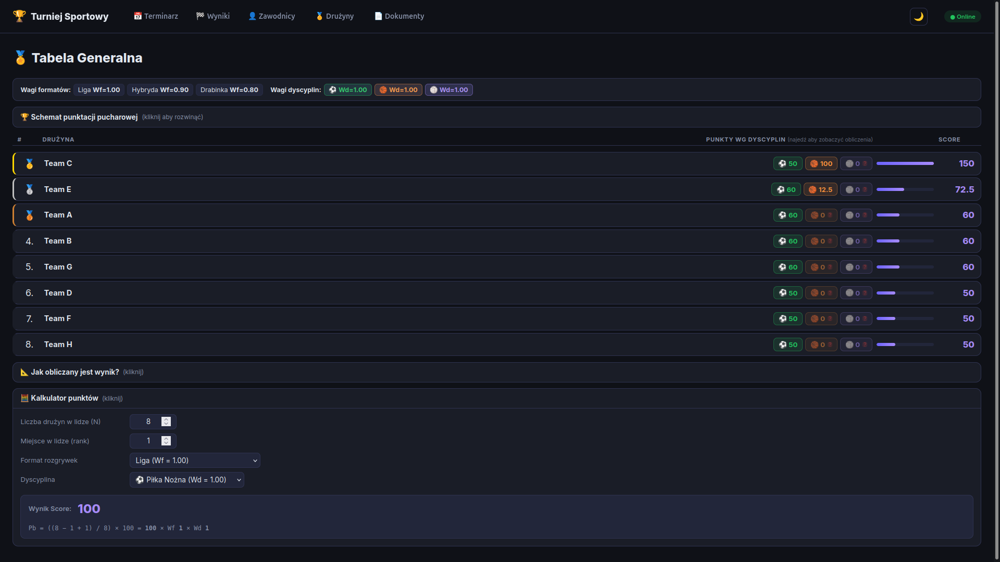
      </a>
      <br>
      <em>Tabela Generalna — ranking łączący wszystkie dyscypliny</em>
    </td>
    <td align="center">
      <a href="Screen/szczegoly-druzyny.png">
        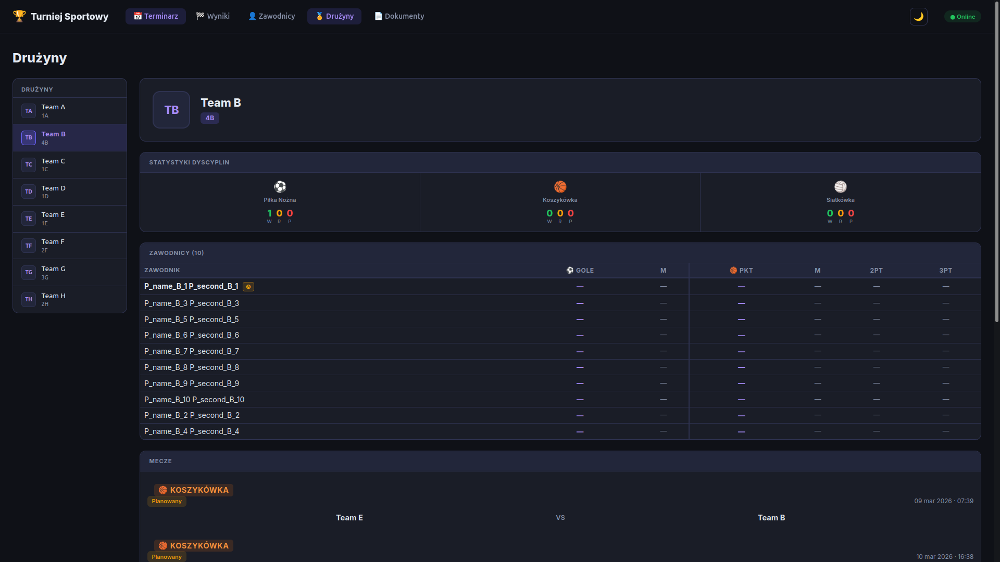
      </a>
      <br>
      <em>Profil drużyny — statystyki, skład, historia meczów</em>
    </td>
  </tr>
</table>

### Panel administracyjny

<table>
  <tr>
    <td align="center">
      <a href="Screen/admin-Dashboard_main.png">
        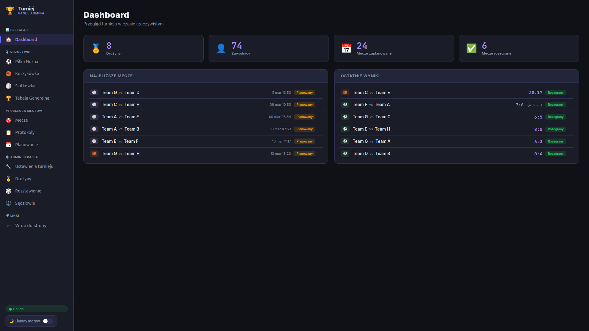
      </a>
      <br>
      <em>Dashboard — statystyki, najbliższe mecze, ostatnie wyniki</em>
    </td>
    <td align="center">
      <a href="Screen/admin-kalendarz.png">
        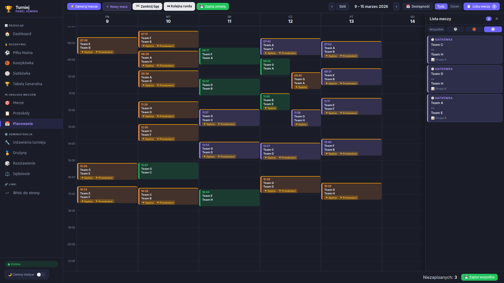
      </a>
      <br>
      <em>Kalendarz — planowanie meczów i kolejek</em>
    </td>
  </tr>
  <tr>
    <td align="center">
      <a href="Screen/admin-mecze-z-otwartymi-szczegolami-meczu.png">
        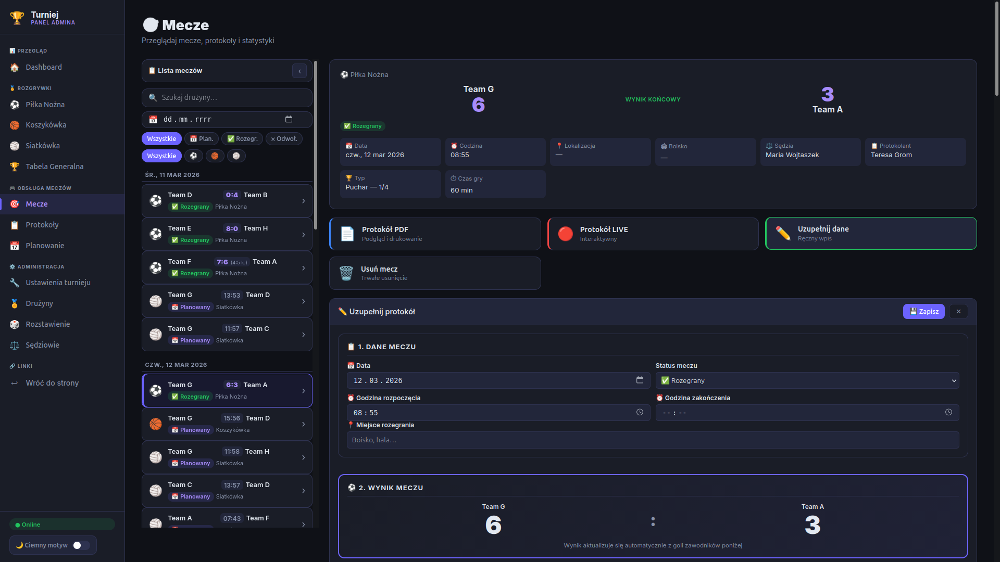
      </a>
      <br>
      <em>Zarządzanie meczami — lista z akcjami</em>
    </td>
    <td align="center">
      <a href="Screen/admin-sekcja-protokoly.png">
        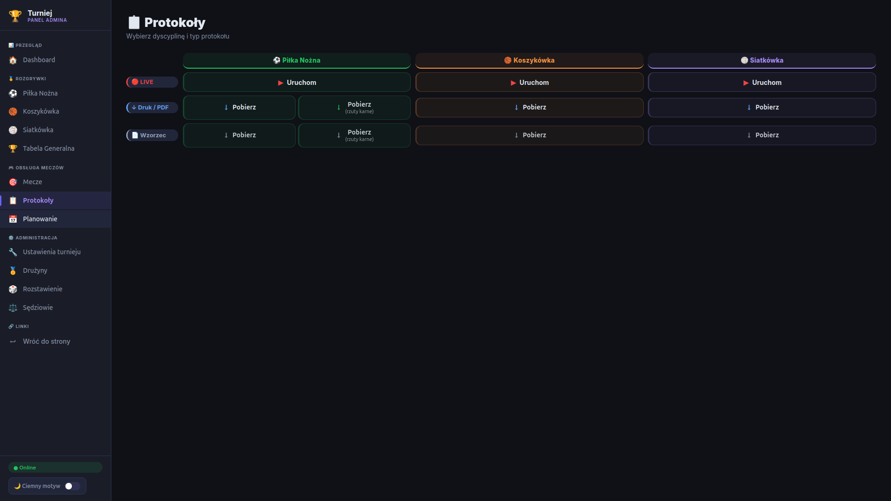
      </a>
      <br>
      <em>Protokoły — podgląd, drukowanie, tryb LIVE</em>
    </td>
  </tr>
</table>

### Protokoły LIVE

<table>
  <tr>
    <td align="center">
      <a href="Screen/protokol-pilka-nozna-widok-protokolu-live.png">
        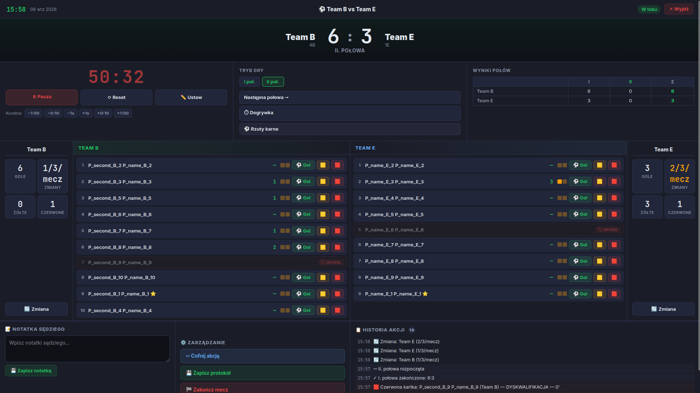
      </a>
      <br>
      <em>⚽ Piłka Nożna — połowy, gole, kartki, zmiany</em>
    </td>
    <td align="center">
      <a href="Screen/protokol-koszykowka-konfiguracja-protokolu-live1.png">
        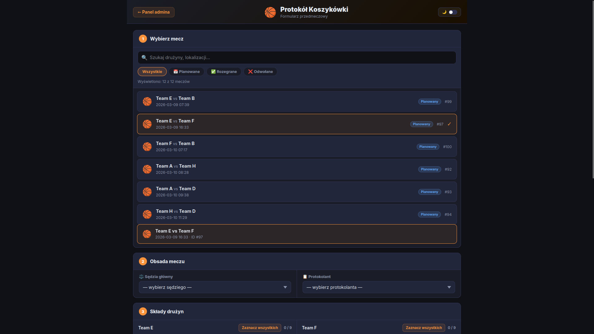
      </a>
      <br>
      <em>🏀 Koszykówka — kwarty, punkty, faule, timeouty</em>
    </td>
    <td align="center">
      <a href="Screen/protokol-siatkowka-konfiguracja1.png">
        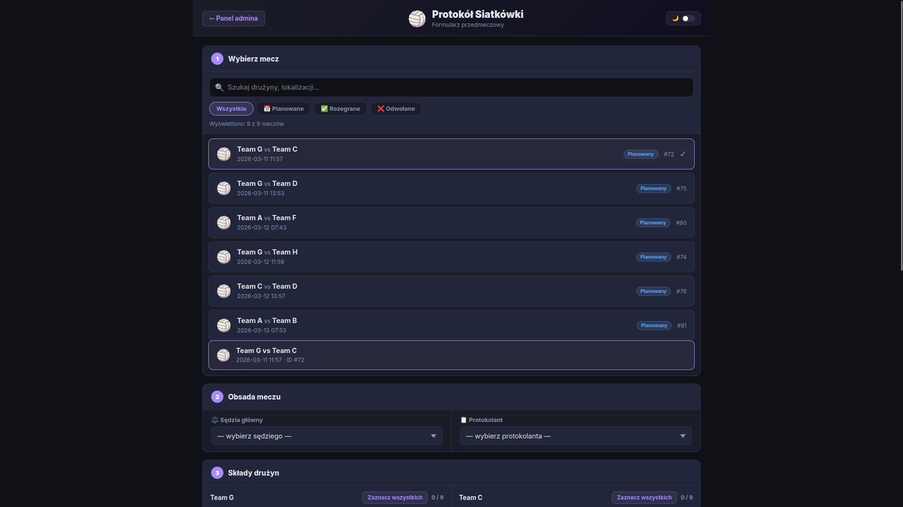
      </a>
      <br>
      <em>🏐 Siatkówka — sety, role zawodników, wyjściowy skład</em>
    </td>
  </tr>
</table>

---

## 👤 Dla użytkownika

Widok publiczny (`index.html`) to kompletna SPA (Single Page Application) z nawigacją opartą na przełączaniu sekcji. Dostępny na komputerze i urządzeniach mobilnych.

### Terminarz
- Przegląd wszystkich meczów z podziałem na dyscypliny
- **Filtry:** status meczu (zaplanowany, zakończony, w trakcie), typ (liga / puchar), wyszukiwanie po nazwie drużyny
- **Linia "Dziś"** — automatyczne wyróżnienie dzisiejszej daty w kalendarzu
- Widok listy i widok kalendarza

### Wyniki
- **Tabele ligowe** — dla każdej dyscypliny osobno, z kolumnami specyficznymi dla danej dyscypliny
- **Drabinki pucharowe** — generowane dynamicznie w SVG, z podglądem wyników
- **Legenda kolumn** — wyjaśnienie skrótów (M = rozegrane, W = wygrane, R = remisy, P = przegrane, Bramki, Pkt)

### Zawodnicy
- Klasyfikacja strzelców / rzucających (z podziałem na punkty 1/2/3 pkt w koszykówce)
- **Rozwijana historia meczów** — po kliknięciu zawodnika widać szczegóły jego występów
- Sortowanie i filtrowanie

### Drużyny
- **Sidebar z listą drużyn** — szybki przegląd
- **Profil drużyny** — statystyki W/D/P (wygrane/remisy/przegrane) per dyscyplina, skład z numerami koszulek i rolami (kapitan), historia meczów

### Tabela Generalna
- Ranking łączący wyniki ze **wszystkich trzech dyscyplin**
- **Kalkulator** — możliwość obliczenia wyników dla dowolnego scenariusza
- Wyjaśnienie algorytmu rankingu

### Dokumenty
- Linki do regulaminu, formularzy zgłoszeniowych, zgód RODO i uczestnictwa

### Motyw jasny/ciemny
- Przełącznik w nagłówku, zapis preferencji w `localStorage`
- Automatyczne przełączenie przy ponownym otwarciu

### Responsywność
- **Desktop:** nawigacja z dropdownami pogrupowanymi według funkcji
- **Mobile:** dolna belka nawigacyjna (bottom nav) z popup wyboru dyscypliny

### Status połączenia
- Wskaźnik online/offline bazy danych w nagłówku — informuje o stanie połączenia z Supabase

---

## 🔧 Dla administratora

Panel administracyjny (`admin_panel/admin.html`) to niezależna SPA z bocznym menu (sidebar) i pełnym CRUD-em dla wszystkich encji turnieju. 

### Dashboard
- Statystyki turnieju (liczba meczów, drużyn, zawodników)
- Najbliższe mecze z detalami
- Ostatnie wyniki

### Zarządzanie meczami
- Lista meczów z **filtrami:** dyscyplina, status, data, wyszukiwanie
- Szczegóły meczu — kliknij, aby zobaczyć pełne informacje
- **Akcje:** eksport PDF, otwórz protokół LIVE, uzupełnij dane, usuń

### Protokoły meczowe
Trzy niezależne protokoły — po jednym dla każdej dyscypliny:
- **LIVE** — interaktywny formularz do wprowadzania wyników w czasie rzeczywistym
- **PDF** — gotowy do druku z pełnymi statystykami
- **Wzorzec** — pusty formularz do ręcznego wypełnienia

Szczegóły w sekcji [Protokoły meczowe](#protokoły-meczowe) poniżej.

### Planowanie
- **Kalendarz tygodniowy/dzienny** — widok meczów w osi czasu
- **Generator meczy** — automatyczne tworzenie kolejnych kolejek
- **Lista meczy (kolejka)** — ręczne przypisywanie meczów do kolejek
- **Edycja meczu** — zmiana daty, godziny, lokalizacji, sędziego
- **Zarządzanie rundami pucharowymi** — tworzenie i edycja rund drabinki

### Ustawienia turnieju
- **Format rozgrywek:** liga, puchar lub hybryda — niezależnie dla każdej dyscypliny
- **Punktacja:** konfiguracja punktów za wygraną/remis/przegraną
- **Grupy:** liczba grup i drużyn w grupie
- **Przepisy meczowe:** czas trwania, dodatkowe połowy/kwarty/sety
- **Informacje ogólne:** nazwa turnieju, sezon, opis

### Drużyny i zawodnicy
- CRUD drużyn (nazwa, kolor, logo, klasa)
- Skład drużyny z kapitanami, numerami koszulek
- Zarządzanie opłatami i zgodami RODO

### Rozstawienie
- **Drag-and-drop** drużyn do grup/slotów
- Losowanie (shuffle) i zapis pozycji
- Widok drabinki i widok tabeli

### Sędziowie i protokolanci
- Zarządzanie personelem sędziowskim
- **Dostępność** — określanie dni i godzin pracy
- Role: sędzia główny, protokolant

### Tabele ligowe i drabinki
- Pełne tabele ligowe per dyscyplina z kompletne statystykami
- Drabinki pucharowe z wynikami

### Tabela Generalna
- Ranking ogólny z perspektywy admina (identyczny algorytm jak w widoku publicznym)

### Logowanie
- **Magic link (email)** — wysłanie linku autoryzacyjnego na podany adres email
- W trybie demo logowanie nie jest wymagane

---

## 📋 Protokoły meczowe

Aplikacja oferuje trzy niezależne protokoły meczowe — po jednym dla każdej dyscypliny. Każdy z nich jest oddzielną stroną HTML z własnym CSS i JavaScript.

> **Ważne:** Wszystkie elementy protokołów (liczba połowych/kwart/setów, czas trwania, limit fauli, liczbę timeoutów, itp.) są **konfigurowalne przez admina** w sekcji **Ustawienia turnieju** → **Przepisy meczowe**. Poniższe wartości to domyślne ustawienia fabryczne.

### ⚽ Piłka Nożna (`protokoly/football.html`)
- **Połowy:** 2 × 45 min + opcjonalne dogrywki (konfigurowalne)
- **Gole:** strzelający, asystujący, minuta
- **Żółte / czerwone kartki**
- **Zmiany** zawodników
- **Rzuty karne** — szczegółowy konkurs rzutów karnych ze śledzeniem każdego strzału (celny/spudłowany, strona bramki)

### 🏀 Koszykówka (`protokoly/basketball.html`)
- **Kwarty:** 4 × 10 min (konfigurowalne)
- **Punkty:** 1 pkt (wolne), 2 pkt (za 2), 3 pkt (za 3) — z automatycznym przeliczaniem
- **Faule:** osobiste, techniczne — z limitem (konfigurowalny, domyślnie 5 fauli → dyskwalifikacja)
- **Timeouty** i zmiany (z limitami)
- **Historia zdarzeń** — oś czasu zdarzeń meczowych

### 🏐 Siatkówka (`protokoly/volleyball.html`)
- **Sety:** do 25 pkt (tiebreak do 15), max 5 setów (konfigurowalne)
- **Role zawodników:** kapitan, libero
- **Wyjściowy skład** — konfiguracja przed meczem
- **Przerwy i zmiany** — z limitami (konfigurowalnymi)

---

## 🏅 Dyscypliny

| Dyscyplina | Emoji | System punktacji | Okresy | Kolumny specjalne |
|---|---|---|---|---|
| **Piłka Nożna** | ⚽ | Gole + rzuty karne | 2 połowy + dogrywki | Bramki, Asysty, Żółte/Czerwone kartki |
| **Koszykówka** | 🏀 | 1/2/3 punkty | 4 kwarty | Punkty (1/2/3 pkt), Faule osobiste/techniczne, Timeouty |
| **Siatkówka** | 🏐 | Punkty w secie | 2-5 setów | Sety, Asysty, Wyjściowy skład |

Każda dyscyplina może niezależnie konfigurować:
- **Format:** liga, puchar lub hybryda
- **Wagę:** wpływ na Tabelę Generalną (domyślnie 1.0)
- **Punktację:** za wygraną/remis/przegraną

---

## 🚀 Szybki start

### Tryb demo — bez serwera

Aplikacja działa **od razu** po pobraniu — otwórz `index.html` w przeglądarce. Dane przykładowe (6 drużyn, 3 dyscypliny, przykładowe mecze i zawodnicy) ładowane automatycznie.

```bash
# Widok publiczny
open index.html

# Panel admina (demo — logowanie nie wymagane)
open admin_panel/admin.html
```

### Tryb live — z bazą danych Supabase

1. **Utwórz konto** na [supabase.com](https://supabase.com) (darmowy plan wystarczy)
2. **Utwórz nowy projekt** — zapamiętaj hasło do bazy
3. **Przejdź do SQL Editor** w panelu projektu
4. **Wklej zawartość pliku `schema.sql`** i uruchom — utworzy wszystkie tabele i widoki
5. **Skopiuj dane z API:**
   - Project URL (np. `https://xyzproject.supabase.co`)
   - Anon/public key (eyJhbGci...)
   - Znajdziesz je w: Dashboard → Settings → API
6. **Otwórz `config.js`** i wklej skopiowane dane:
   ```js
   SUPABASE_URL: 'https://twoj-projekt.supabase.co',
   SUPABASE_ANON_KEY: 'eyJhbGci...',
   ```
7. **Odśwież stronę** — aplikacja przełączy się na tryb live

### Logowanie do panelu admina (tryb live)

1. Otwórz `admin_panel/login.html`
2. Wpisz adres email i wyślij link
3. Kliknij link w emailu — zostaniesz przekierowany do panelu

---

## 🗄 Baza danych

Schemat bazy danych Supabase (PostgreSQL) definiuje 12 tabel i 2 widoki.

### Tabele

| Tabela | Opis |
|---|---|
| `people` | Osoby — uczniowie, sędziowie, protokolanci (imię, email, klasa, rola) |
| `teams` | Drużyny szkolne (nazwa, kolor, logo, klasa) |
| `players` | Zapisy zawodników do drużyn (drużyna, osoba, numer, kapitan, opłata, zgody RODO) |
| `matches` | Mecze (dyscyplina, typ, drużyny, data/godzina, wyniki, rzuty karne, status) |
| `match_periods` | Okresy meczu — połowy/kwarty/sety (punkty, timeouty, zmiany) |
| `match_player_stats` | Statystyki zawodnika w meczu (gole, asysty, kartki, punkty 1/2/3 pkt, faule) |
| `match_team_stats` | Statystyki drużyny w meczu (faule, timeouty, zmiany) |
| `match_logs` | Oś czasu zdarzeń meczowych (gole, kartki, timeouty) |
| `tournament_format` | Format rozgrywek per dyscyplina (liga/puchar, punktacja, grupy, wagi) |
| `tournament_settings` | Ustawienia turnieju (klucz-wartość: sezon, nazwa) |
| `seeding` | Rozstawienie drużyn per dyscyplina (pozycja w grupie/slocie) |
| `people_availability` | Dostępność sędziów i protokolantów (dzień tygodnia, godziny) |

### Widoki

| Widok | Opis |
|---|---|
| `matches_full` | Mecze z nazwami drużyn i sędziów (bez JOIN w zapytaniach) |
| `player_stats_full` | Statystyki zawodników z danymi osobowymi i drużynowymi |

---

## 📁 Struktura projektu

```
├── index.html                 # Widok publiczny (SPA)
├── app.js                     # Logika publiczna — widoki, nawigacja, renderowanie
├── style.css                  # Style publiczne (jasne/ciemne)
├── config.js                  # ← EDYTUJ: konfiguracja Supabase (URL + anon key)
├── supabase-client.js         # Klient Supabase (automatycznie: demo lub live)
├── mock-data.js               # Dane przykładowe (tryb demo)
├── mock-supabase.js           # Mock klienta Supabase (tryb demo)
├── schema.sql                 # Schema bazy danych do Supabase
│
├── admin_panel/
│   ├── admin.html             # Panel admina (SPA)
│   ├── admin.css              # Style admina
│   ├── admin-globals.js       # Helpery globalne, API, operacje CRUD
│   ├── admin-nav.js           # Nawigacja boczna (sidebar)
│   ├── admin-dashboard.js     # Dashboard — statystyki i podgląd
│   ├── admin-mecze.js         # Zarządzanie meczami + live scoring
│   ├── admin-druzyny.js       # Drużyny i zawodnicy
│   ├── admin-planowanie.js    # Kalendarz i planowanie meczów
│   ├── admin-sedziowie.js     # Sędziowie i protokolanci
│   ├── admin-sport.js         # Tabele ligowe, drabinki SVG, rankingi
│   ├── admin-turniej.js       # Format i ustawienia turnieju
│   ├── admin-ranking.js       # Tabela Generalna
│   ├── admin-rozstawienie.js  # Rozstawienie drużyn (drag-and-drop)
│   ├── admin-print-protocols.js # Drukowanie protokołów PDF
│   └── login.html             # Logowanie magic linkiem
│
├── protokoly/
│   ├── football.html/js/css   # Protokół meczu piłki nożnej
│   ├── basketball.html/js/css # Protokół meczu koszykówki
│   └── volleyball.html/js/css # Protokół meczu siatkówki
│
├── Screen/                    # Screenshoty interfejsu
├── dokumentacja-techniczna.html # Dokumentacja techniczna (HTML)
└── tutorial-uzytkownika.html  # Podręcznik użytkownika panelu admina
```

---

## 💻 Technologie

| Warstwa | Technologia | Szczegóły |
|---|---|---|
| **Frontend** | HTML5, CSS3, JavaScript (ES2022) | Zero frameworków, zero bundlera — pliki serwowane bezpośrednio |
| **Baza danych** | Supabase (PostgreSQL) | Klient JS z CDN `@supabase/supabase-js@2` |
| **Auth** | Supabase Auth | Magic link (email OTP) w trybie live |
| **Drabinki** | jQuery Bracket 0.11.1 | Tylko w panelu admina — wizualizacja drabinek |
| **Czcionki** | Google Fonts | Inter (publiczny), JetBrains Mono + Syne (admin), DM Mono (tutorial) |
| **SVG** | Vanilla SVG DOM API | Drabinki pucharowe generowane dynamicznie |
| **Drag & Drop** | HTML5 DnD API | Rozstawienie drużyn i planowanie meczów |

---

## ⚠️ Wymagania

- Przeglądarka (Chrome, Firefox, Safari, Edge — aktualna wersja)
- Do trybu live: konto Supabase (darmowy plan wystarczy)

